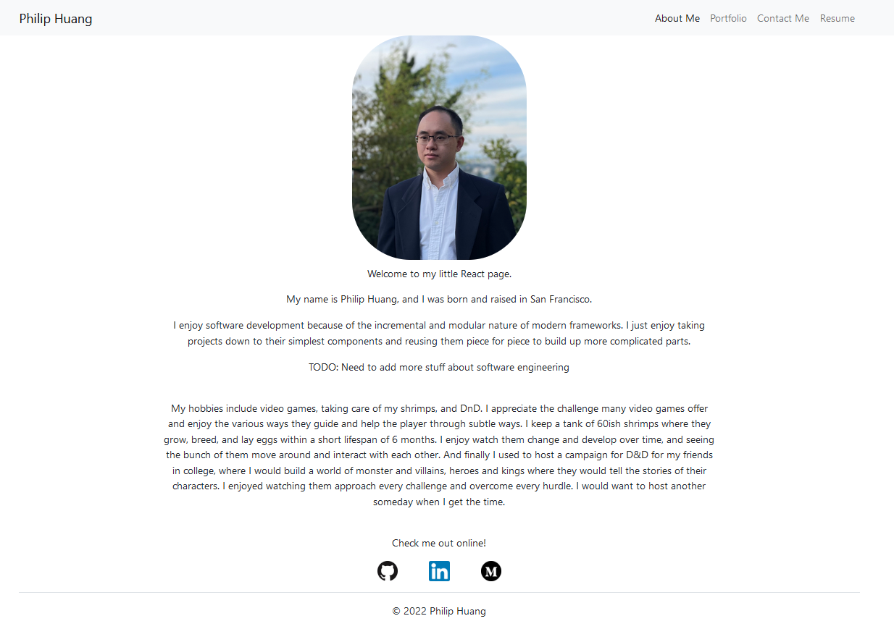

# React-Profile
Near the start of my bootcamp, the instructors asked me to make a portfolio using bootstrap and basic html and css.  It was fun, and interesting, and now we are coming full circle with making another portfolio.  React is interesting, because it melds together HTMl, and Javascript and divorces me from the HTML syntax.  

This project showed me how presentable my projects can be, and what to focus on.  I regret not using a cheaper API for my project 1 cause now it is hard to display it to employers.  It was hard to deploy this application for some reason, cause I installed GH-Pages in dependencies rather than developers dependencies.  I am not sure how that happened.  Another problem was that I needed to add the onBlur function which triggers whenever the text area is not selected.

This was fun to make

# Table of Contents
- [Landing](#landing)
- [License](#license)
- [Questions](#questions)

# Landing

# License

This project is covered under the MIT License.

Additional information can be obtained in the About Section.

# Questions
  
Want to check out more of my work?  Check me out at my github [profile](https://github.com/PhilipHuang2).
  
Have any questions?
  
Feel free to email me at Philiphuang2@gmail.com.